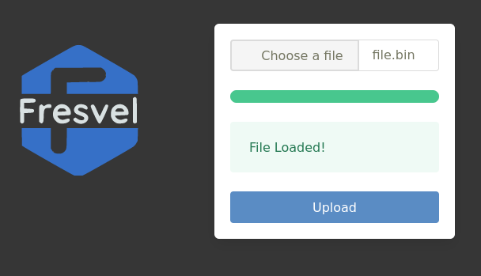

| Supported Targets | ESP32 | ESP32-C2 | ESP32-C3 | ESP32-C6 | ESP32-H2 | ESP32-S2 | ESP32-S3 |
| ----------------- | ----- | -------- | -------- | -------- | -------- | -------- | -------- |

# _Web Firmware for ESP32_

(See the README.md file in the upper level 'examples' directory for more information about examples.)


To configure the project, you have to set the following configurations inside menuconfig:

- In the serial flasher config option, set a minimum of 4MB for the flash size.
- Set the partition table for at least two OTA partitions and a data partition with the subtype 'spiffs,' named 'storage.'
- Enable the HTTPS server in the component config inside menuconfig.
- In the HTTP server option of the component config, enable WebSocket support.
- Make sure you have the 'files' directory in the root of your application. 


This project integrates a simple WebSocket server with a native OTA for downloading updates for the ESP32 via an HTTPS server.



The basic structure of the fileproject is showing below:
```
├── CMakeLists.txt
├── main
│   ├── CMakeLists.txt
│   └── main.c
├── README.md               This is the file you are currently reading
├── Components              This directory contains the compones of the project      
├── Files                   This directory contains the files for the HTTPS server
├── Images                  This directory contains the images for the Readme section.
│   
└── README.md

```

The compones of the project include the following applications:
1. Wifi --This will migrate to Network for manage the network connections via Wifi or Ethernet
2. Filesystem
3. Uart
4. Gpio
5. MQTT
6. OTA --Used to update from https server
7. WebsocketOTA 

1. ## Network
2. ## Filesystem
Filesystem allows you to magane the used directory for web applications like https server and websocket OTA.

This directory will contain the files for magage the web applications wia websocket in which you would be load web pages making partials requests.

7. Websocket
On the websocket server requests will be processed in two ways: as a data request or as a file request. All requests arrive to ws_hadler and then if it has the correct schema for a ws_app request, them are directionated to six diferent functions. For manage the ws_app requests a json object is used, and its structure is described below:

ws_app={
    "ws-type": "",
    "ws-info": {}
}


Where ws-type is a string that contains the name of one of the six diferents functions that are managed on the websocket server. On another hand ws-info is an object wich contains the information for the final request. The different types are as follows:

- ws-body.- To change the content of the ws-body div element
- ws-section.- To change the content of a specific section
- ws-linker.- To get information in a directly mode in a public subscribe scheme
- ws-header.- To change the content of the header
- ws-footer.- To change the content of the footer
- ws-system.- To manage functions on the system like autentications, erros ota.


The object structure for the ws-linker has the following properties:

ws-linker={
    "ws-method"="publish/subscribe",
    "ws-info"={
        "link-client":["session", "client-id"], //the variable session is stablished via ws-system
        "ws-data":["dir1","data 1", "dir2", "data 2", "dirn", "datan"] //in the case of subscribe only dir no data
    }
}/*make this only with sockets not websockets and compare with websockets coap and similars*/

The object structure for the ws-system has the following properties:
ws-system={
    "ws-method"="ws-functions",
    "ws-info"={
        "param1":[]
        "param2":[]
    }
}

For body, section header and footer the structure is as follows:

ws-content={
    "ws-method"="ws-header/footer...",
    "ws-info"={
        "param1":[]
        "param2":[]
    }
}// here param refers to a id in thml and a file in esp32


For the ws-linker type the websocket server creates a task wich will manage the suscription and publish schema for clients, the array for this fuction is diferent of others and the idea is to interchange data betwen clients and server in a directly mode. The another methods use a simple string array, and will return the files with the names of the array items. 


# Websocket-based Firmware for Iot Devices

This is the simplest buildable example. The example is used by command `idf.py create-project`
that copies the project to user specified path and set it's name. For more information follow the [docs page](https://docs.espressif.com/projects/esp-idf/en/latest/api-guides/build-system.html#start-a-new-project)


## How to use example
We encourage the users to use the example as a template for the new projects.
A recommended way is to follow the instructions on a [docs page](https://docs.espressif.com/projects/esp-idf/en/latest/api-guides/build-system.html#start-a-new-project).

## Example folder contents

The project **sample_project** contains one source file in C language [main.c](main/main.c). The file is located in folder [main](main).

ESP-IDF projects are built using CMake. The project build configuration is contained in `CMakeLists.txt`
files that provide set of directives and instructions describing the project's source files and targets
(executable, library, or both). 

Below is short explanation of remaining files in the project folder.

```
├── CMakeLists.txt
├── main
│   ├── CMakeLists.txt
│   └── main.c
└── README.md                  This is the file you are currently reading
```
Additionally, the sample project contains Makefile and component.mk files, used for the legacy Make based build system. 
They are not used or needed when building with CMake and idf.py.
